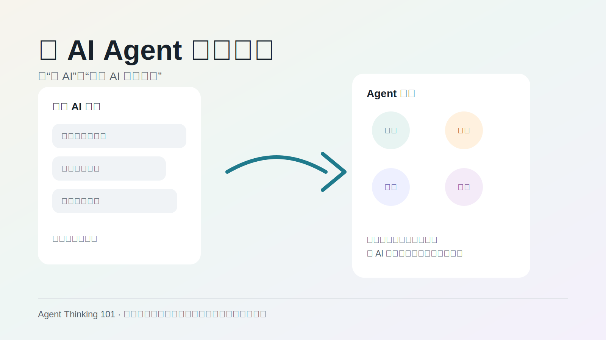
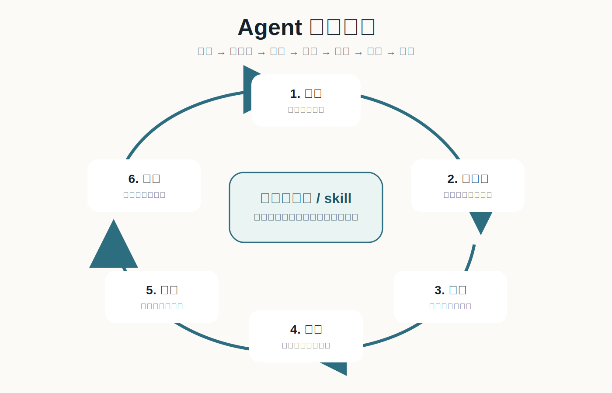
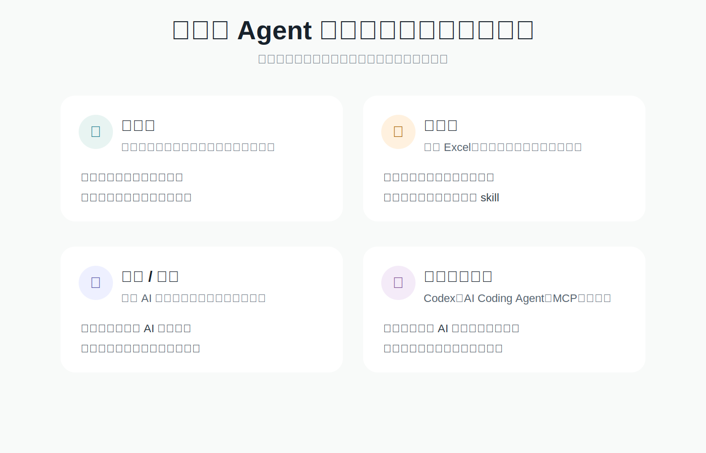

# Agent Thinking 101 视觉资产

这里记录现有配图、各自适合放在哪里，以及之后可能生成的新图。先把用途写清楚，免得图片越做越多，最后却不知道该放哪一页。

## 当前本地 SVG

### 1. 课程主视觉



用途：

- 课程介绍页首图。
- 小红书封面草稿。
- Notion / 飞书文档头图。
- 线下试讲首页投影。

图里要说清楚：

从“问一句、答一句”的普通 AI 使用，升级到“目标、工具、反馈、作品”的 Agent 思维。

### 2. Agent 协作循环



用途：

- 第一章解释 Agent 思维。
- 第三章解释先计划、再执行、再检查。
- 讲师手册中作为课堂板书参考。

图里要说清楚：

目标、上下文、计划、工具、反馈、检查、记忆/skill 是一个循环，不是一次性 prompt。

### 3. 适合人群地图



用途：

- 对外摘要版。
- 课程页“适合谁”模块。
- 招生或内测沟通时说明课程不只适合少儿。

图里要说清楚：

同一种 Agent 思维，可以服务青少年、成年人、家长老师和效率工具用户。

## Packy 图片生成说明

当前环境没有检测到 `PACKY_SORA_TOKEN`，所以本轮没有直接调用 Packy 生成图片。为了避免密钥出现在命令历史或文件里，后续如果要生成图片，请先在本地终端里设置环境变量：

```bash
export PACKY_SORA_TOKEN="你的 Packy token"
```

然后可以使用 `packy-imagegen` 生成更有传播感的图片。

## Packy 生成提示词

### 提示词 1：课程主视觉插画

```text
一张现代、温暖、清爽的课程主视觉插画。画面中心是一个普通年轻人坐在电脑前，旁边不是机器人形象，而是一个抽象的 AI 协作者界面。屏幕周围浮现出网页作品、Excel 表格、旅行计划、学习卡片、代码窗口和任务看板，表达“和 AI Agent 一起做事”。风格简洁、有教育感、适合中文课程封面，不要科幻感过强，不要赛博朋克，不要过度蓝紫渐变。画面留出上方标题空间。无英文文字。
```

建议尺寸：`1536x1024`

### 提示词 2：从聊天到做事

```text
一张信息图风格的插画，左侧是普通聊天气泡，内容很零散；右侧是一个清晰的任务工作台，包括目标、计划、工具、检查和作品。中间有自然的转变箭头，表达从“问 AI”到“让 AI 做事”。风格现代、简洁、适合教育课程，不要复杂背景，不要真实人物照片，不要英文文字。
```

建议尺寸：`1536x1024`

### 提示词 3：青少年和成年人都能用

```text
一张课程宣传插画，画面分成两半但整体统一：一边是青少年用 AI 做个人主页、小游戏和学习助手；另一边是成年人用 AI 处理表格、写报告、做旅行计划和小工具。整体表达同一种 Agent 思维适合不同年龄和场景。风格温暖、干净、真实，不要卡通过度，不要商务广告感，不要英文文字。
```

建议尺寸：`1536x1024`

### 提示词 4：Agent 协作循环

```text
一张中文教育课程用的流程视觉图，展示一个人和 AI Agent 协作的循环：目标、上下文、计划、工具、反馈、检查、记忆。画面可以用图标和流程节点表示，风格清晰、现代、适合放在课程 PPT 里。不要使用复杂小字，不要英文文字。
```

建议尺寸：`1536x1024`
